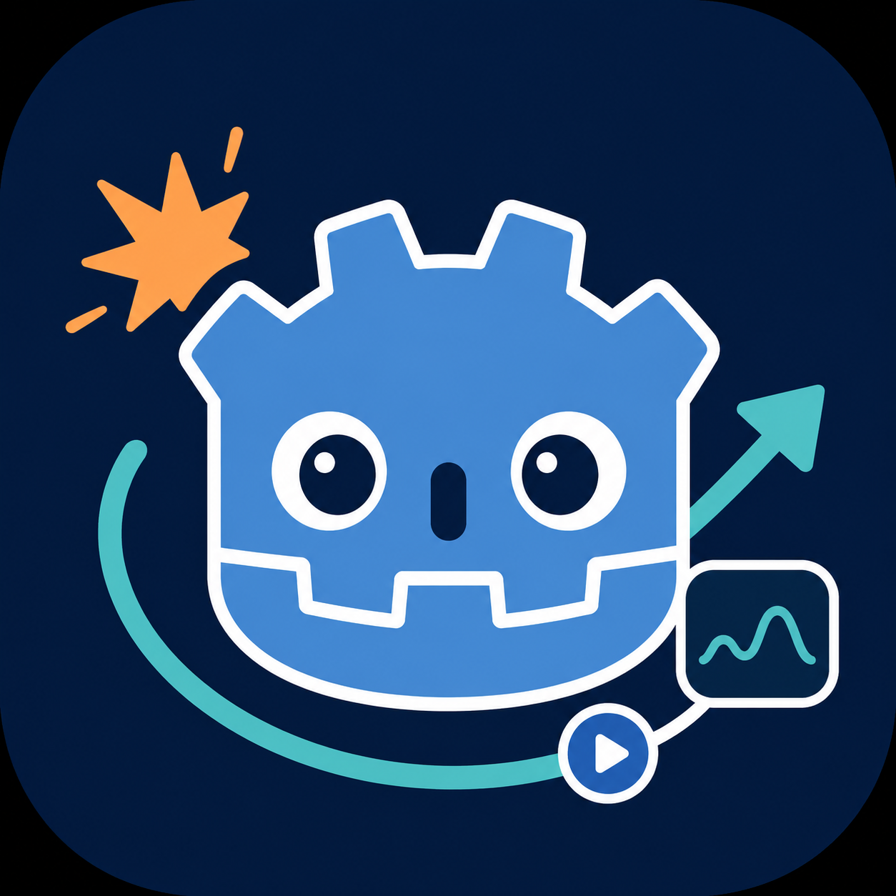

<p align="center">
  
</p>

# Game Feel Flow

<p align="center">🎮 One-stop game feel (juice) system for Godot — shake, flash, freeze frames, camera work and more, as composable data-driven effects.</p>

[](https://godotengine.org/)
[](LICENSE)
[](https://zoroiscrying.github.io/godot-plugin-game-feel-flow/)
[](#-pro-version)

---

## ✨ Why Game Feel Flow?

- 🎯 **One-line effects** — `GFUtil.hit(self, 2.0)` and you're done
- 🧩 **29 built-in effects + 15 ready-made combos** — transform, camera, audio, time, particles, physics, events
- 🎛️ **Edit in the Inspector** — the `GFFPlayer` node exposes combos and effects directly in the Godot Inspector, no code required
- 🔁 **Loop modes** — Repeat / Ping-Pong / Mirror, finite or infinite, for breathing, heartbeat and warning-idle effects
- 📈 **Custom easing curves** — override any tweener with a visual `Curve`
- ⚡ **Overlap strategies** — Ignore / Cancel / Replace / Queue / Add when effects collide
- ↩️ **Editor Undo/Redo** — all Inspector edits integrate with `EditorUndoRedoManager`


---

## 🚀 Installation

### From the Godot Asset Library (recommended)

1. Open the **AssetLib** tab in the Godot editor
2. Search for **"Game Feel Flow"** and install
3. Enable the plugin in **Project → Project Settings → Plugins**

### From GitHub

1. Download the [latest repository archive](https://github.com/Zoroiscrying/godot-plugin-game-feel-flow)
2. Copy `addons/game_feel_flow` into your project's `addons/` folder
3. Enable the plugin in **Project → Project Settings → Plugins**

---

## 🎮 Quick Start

```gdscript
# Method 1: GFUtil shortcuts (fastest)
GFUtil.hit(self, 2.0)
GFUtil.death(self)
GFUtil.pickup(self)

# Method 2: GameFeelFlow singleton
GameFeelFlow.play("hit", self, {"intensity": 2.0})

# Method 3: GFFPlayer node (no code — configure combos in the Inspector)
$GFFPlayer.play("hit", {"intensity": 2.0})
```

Chained parameters:

```gdscript
GameFeelFlow.play("shake", self, GFFParams.create(2.0, 0.5)
    .with_float("amplitude", 15.0)
    .with_color("color", Color.RED)
    .with_curve("curve", my_curve))
```

📖 Full guide: [Quick Start](https://zoroiscrying.github.io/godot-plugin-game-feel-flow/getting-started/quick-start/)

---

## 🎬 Open this first

Try the example scenes in this order:

1. **`addons/game_feel_flow/examples/showcase.tscn`** — Free reel for recording and first impressions (**16:9**). Shots **loop in place**; use **Prev / Next** to change shots and **H** to hide the chrome bar.
2. **`addons/game_feel_flow/examples/onboarding.tscn`** — Short walkthrough of `GFFPlayer` and combos.
3. **`addons/game_feel_flow/examples/effect_library.tscn`** — Full effect catalog / lab.
4. **`addons/game_feel_flow_pro/examples/showcase.tscn`** *(Pro)* — Pro-only reel with the same transport controls.

📖 [Examples documentation](https://zoroiscrying.github.io/godot-plugin-game-feel-flow/examples/)

---

## 🎯 Built-in Effects (Free — 29)

| Category | Effects |
|----------|---------|
| **Transform** | `shake_position` `shake_scale` `shake_rotation` `punch_position` `punch_scale` `punch_rotation` `curved_position` `curved_scale` `curved_rotation` (aliases: `shake`, `punch`) |
| **Visual** | `flash` `color` `alpha` |
| **Camera** | `camera_shake` `camera_zoom` `camera_fov` `camera_flash` |
| **Audio** | `sound` `audio_volume` |
| **Time** | `freeze_frame` `time_scale` |
| **Particles** | `particles` `gpu_particles` |
| **Physics** | `impulse` `velocity` |
| **Animation** | `tween` `animator` |
| **Events** | `event` `signal` `method` |

Plus **15 built-in combos**: `hit_light/medium/heavy/critical`, `death`, `death_explosion`, `pickup`, `pickup_coin/health/power`, `explosion`, `explosion_small/large`, `ui_button_press`, `ui_notification`.


---

## 🔁 Loop Effects

Any effect can loop — `loop_count = -1` loops forever, `0` plays once:

- **Repeat** — restarts from the beginning each cycle
- **Ping-Pong** — alternates direction without drift
- **Mirror** — inverts target parameters on odd iterations, tween direction unchanged

Perfect for breathing, heartbeats, warning pulses and idle animations.


📖 [Looping documentation](https://zoroiscrying.github.io/godot-plugin-game-feel-flow/effects/looping/)

---

## 💎 Pro Version

**Game Feel Flow Pro** is a paid extension that drops into `addons/` alongside the free version:

- 🖥️ **Timeline Editor** — arrange effect blocks on tracks: multi-select, copy/paste, snap-to-grid, event blocks, mouse-wheel zoom
- 🎨 **23 additional effects** — UI (9), screen shaders (6), advanced audio (3), material (2), squash & stretch / spring / wiggle (3)
- 🧰 **10 extra targets + 2 tweeners + 15 editor presets**

👉 [Get Game Feel Flow Pro on itch.io](https://zoroiscrying.itch.io/game-feel-flow-pro)


📖 [Pro documentation](https://zoroiscrying.github.io/godot-plugin-game-feel-flow/pro/)

---

## 📖 Documentation

- **Online docs**: https://zoroiscrying.github.io/godot-plugin-game-feel-flow/
- [Installation](https://zoroiscrying.github.io/godot-plugin-game-feel-flow/getting-started/installation/)
- [API Reference](https://zoroiscrying.github.io/godot-plugin-game-feel-flow/api/)
- [Effect List](https://zoroiscrying.github.io/godot-plugin-game-feel-flow/effects/)

---

## 🧩 Custom Effects

Extend `GFFEffect` to create your own:

```gdscript
class_name MyEffect
extends GFFEffect

func _execute(node: Node, params: GFFParams) -> void:
    var intensity = _get_intensity(params)
    var duration = _get_duration_param(params)
    # Your effect logic here...
```

---

## 🤝 Contributing

Issues and Pull Requests are welcome on the [public repository](https://github.com/Zoroiscrying/godot-plugin-game-feel-flow)!

---

## 📄 License

MIT License — see [LICENSE](LICENSE).

## 🙏 Credits

- [Unity Feel by More Mountains](https://assetstore.unity.com/packages/tools/utilities/feel-176399) — Inspiration
- [Godot Engine](https://godotengine.org/) — Game engine

---

<p align="center">
  Made with ❤️ for the Godot community
</p>
